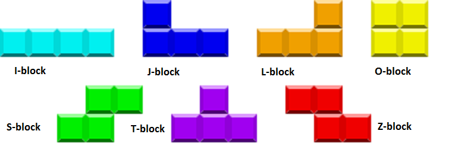
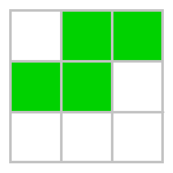
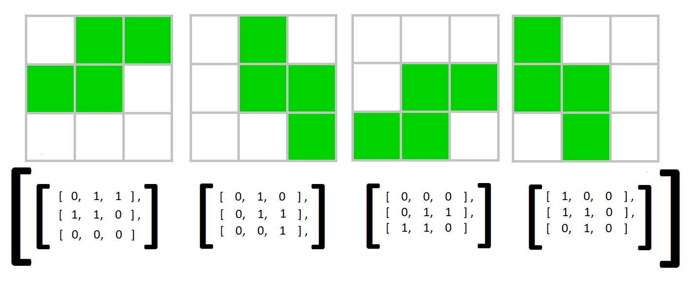

<p align="center">
  <a href="https://raufhacizade.github.io/Tetris-Game/">
     
  </a>
</p>

<h2 align="center"> This game was created as a responsive web project. The main logic of the game is created by using pure JavaScript and HTML, CSS.</h2>
<br/>

If you want to play the game before dive deep into the source code, you can click [here](https://raufhacizade.github.io/Tetris-Game/) or the picture above. It is also recommended that you know what the Tetris game is and how it is played. You can get detailed info about this from this [link](https://en.wikipedia.org/wiki/Tetris).
<br/>

<h2 align="center">Basic information about the game</h2>

First of all, there are some basic information we need to know about the Tetris game.The main pieces of the game concept are **The game board, Tetrominoes, Walls, Square.**
<br/>

**The game board** - The game is played on a board that will be implemented to [HTML Canvas](https://www.w3schools.com/html/html5_canvas.asp) element, that has 17 rows and 10 columns. We can consider that a 2d array.
<br/>

**Tetrominoes** are the main figures in the game. There are 7 different pieces in the shape of  Z, T, L, O, I, J, and S letters. These tetrominoes are able to move to the right, to the left, and rotate. Also, Tetrominoes always have to fall down until they reach the bottom. When the Tetromino hits the bottom, we lock it on the board. Then the game should generate a new one randomly.

<p align="center">
   
</p>
<br/>

**Square** - We can consider that squares are atoms of objects of our game world. The board and the Tetrominoes are both made of squares that are regular quadrilateral. All of the four sides and four angles of a square are equal. The side size of a square will be constant.
<br/>

**Walls** - there are two walls, the right and the left wall.
<br/>


<h2 align="center">How to create a Tetromino?</h2>

Let's take  the **S piece** as an example. The picture below represents how the **S Tetromino** looks in a 3x3 square system.
<p align="center">
   
</p>

If we think of this piece as a **2-dimensional array**, we can think of each square of this piece as a **1** or a **0**. The idea is, for a **VACANT**(empty) square we give **0**, and for an **occupied(colored)** square we give **1**.Now, the above picture is just one model out of four, the 2-dimensional array for this model should be like below.

```javascript
///S Tetromino representation as a 2d array
[ [ 1, 1, 0],
  [ 0, 1, 1],
  [ 0, 0, 0 ] ]
```

<br/>
There is a rule that player should be able to rotate a Tetromino, the easiest way to do that with code, is to put 2d array representation of  each model of a Tetromino inside an array.Now, we need to create an array for each Tetromino, and this array should contains of 4 models of the Tetromino. Below picture is the example of S Tetromino.

<p align="center">
   
</p>
<br/>


<h2 align="center">How to create the Game Board?</h2>

Above we said that we will look **Game Board** as an 2d array.We need 2 for loops if we want to loop through our 2d array. We will create the **rows** with the first loop, and the **columns** with second one.

```javascript
const row=20;
const column=10;
let  board;

function fillBoard(){
  board=[];
  for (var r = 0; r < row; r++) {
    board[r]=[];
    for (var c = 0; c < column; c++) {
      board[r][c]=VACANT;
    }
  }//end of board
}
```


                                                                           
                                                                           
